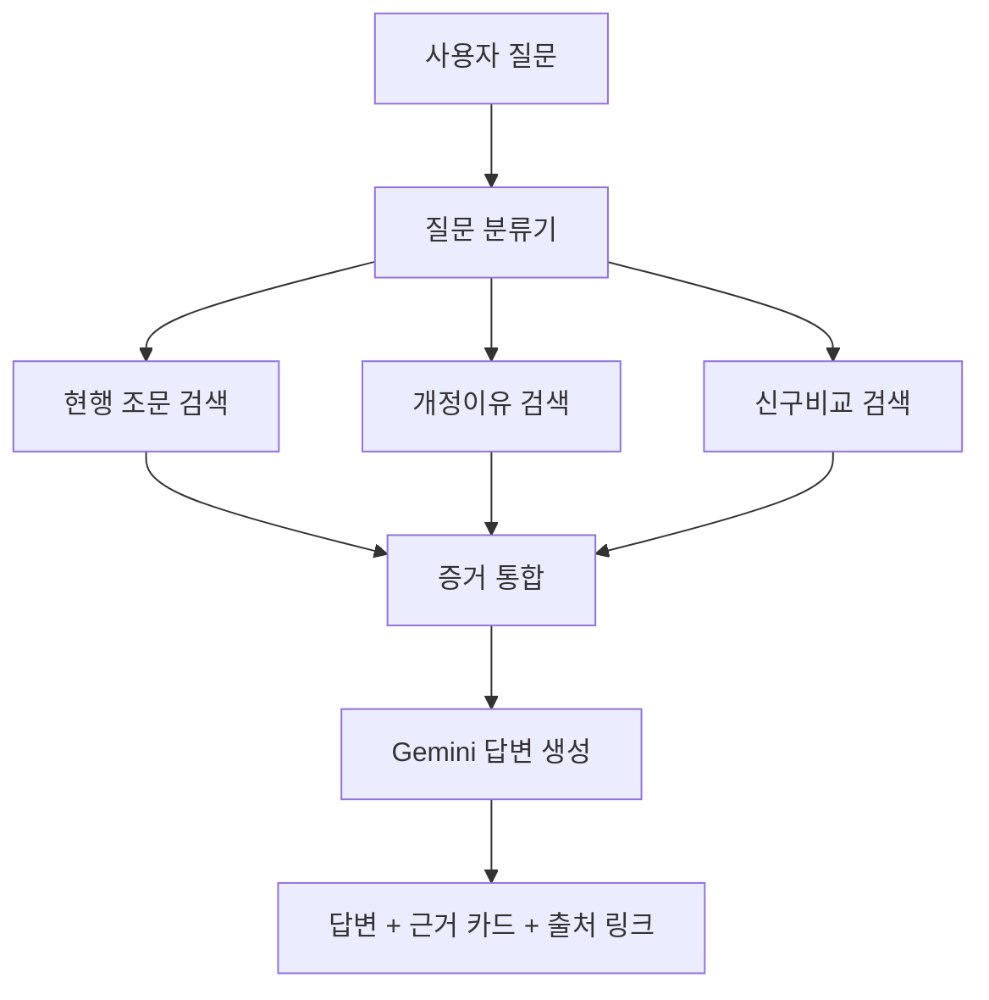

# 시스템 아키텍처 설계서

## 1. 목표
이 MVP는 단순 질의응답 챗봇이 아니라, **버전관리형 규정 RAG**를 구현하는 데 목적이 있습니다.  
즉, 사용자는 다음 세 가지를 동시에 물을 수 있어야 합니다.

1. **무엇이 현재 규정인가?**
2. **왜 그 규정이 바뀌었는가?**
3. **실무적으로 나는 어떻게 행동해야 하는가?**

## 2. 논리 아키텍처

## 3. 데이터 계층
### 3.1 원천 수집 계층
- law.go.kr 공개 페이지 다운로드
- law.go.kr Open API(선택): 현행 본문, 연혁, 신구법
- 제·개정이유 HTML 수집

### 3.2 정규화 계층
- HTML/XML → text/markdown/jsonl
- 공통 메타데이터 부여
  - `law_name`
  - `law_level`
  - `source_type`
  - `version_label`
  - `promulgation_date`
  - `effective_date`
  - `article_no`
  - `article_title`
  - `revision_kind`
  - `source_url`

### 3.3 벡터 저장 계층
- Chroma PersistentClient 사용
- 컬렉션 단위: `army_public_law_rag`
- 문서 유형별 구분:
  - `law_text`
  - `revision_reason`
  - `old_new_comparison`
  - `history_note`
  - `guide_note`

## 4. 질의 라우팅
질문은 다음 세 유형으로 분류합니다.

### 4.1 Search
예: “군인의 지위 및 복무에 관한 기본법에서 휴가 관련 규정 찾아줘”
- 우선 검색: `law_text`
- 보조 검색: `revision_reason`

### 4.2 Explain Change
예: “왜 육아시간 규정이 바뀌었어?”
- 우선 검색: `revision_reason`
- 보조 검색: `old_new_comparison`, `history_note`

### 4.3 What Should I Do
예: “그러면 나는 어떤 절차로 처리해야 해?”
- 우선 검색: `law_text`
- 보조 검색: `revision_reason`
- 출력 제한: 법률자문 아님, 실무 참고용

## 5. 답변 포맷 원칙
모든 답변은 아래 구조를 유지하도록 설계합니다.

1. **핵심 답변**
2. **근거 요약**
3. **실무상 유의점**
4. **출처 문서 목록**

## 6. 설계상 핵심 차별점
### 6.1 시간축 반영
현행 조문만 저장하면 “왜 바뀌었는지” 설명할 수 없습니다.  
따라서 연혁·신구비교·개정이유를 별도 층으로 분리합니다.

### 6.2 근거 분리
“개정이유”와 “조문본문”을 한 덩어리로 넣으면 검색 품질이 떨어집니다.  
따라서 문서 타입별 검색 가중치를 다르게 둡니다.

### 6.3 실무 답변 안전장치
행동형 답변은 반드시 근거조문을 같이 제시하고,
근거가 부족하면 **“근거자료 부족”**으로 응답하도록 설계합니다.

## 7. 향후 확장 방향
- 육군 내부 훈령·예규·지침까지 확장
- 부서별 권한 기반 검색
- 개정 초안 자동 작성 지원
- 신구조문대비표 초안 자동 생성
- 질의 로그 분석 기반 FAQ·반복민원 대응