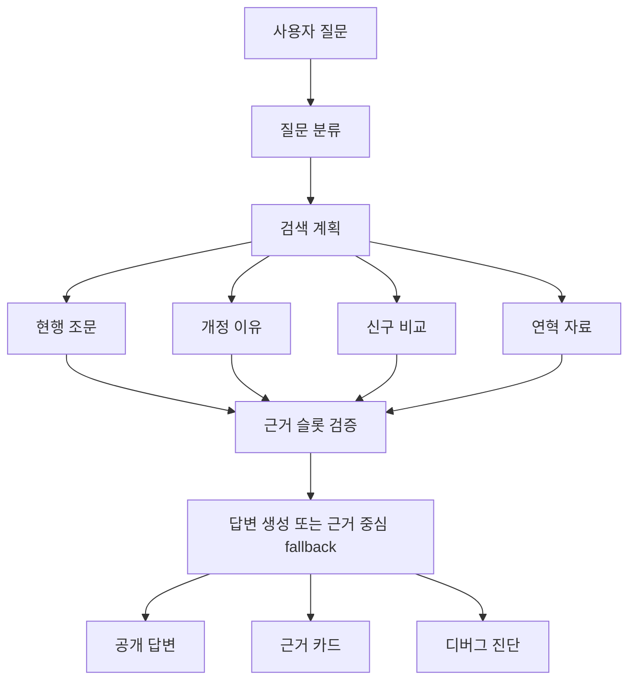

# 시스템 아키텍처 설계서

## 1. 목표
이 MVP는 일반 법률상담 챗봇이 아니라, 공개 법령 자료를 이용해 **버전 인지형 군 복무 법규 RAG**의 가능성을 검증하는 앱이다.

사용자가 기대하는 답변은 다음 세 가지를 구분해야 한다.

1. 현재 유효한 조문은 무엇인가.
2. 해당 규정은 어떤 연혁과 개정 이유를 거쳐 왔는가.
3. 실무 참고 관점에서 어떤 원문과 근거를 함께 확인해야 하는가.

## 2. 실행 경로
이 저장소에는 두 개의 UI 경로가 있다.

- `streamlit_app.py`: 공개 시연용 경로. Gemini 또는 retrieval fallback을 사용하며 질문 수 제한과 안전 문구를 유지한다.
- `local/streamlit_app.py`: 로컬 LM Studio 실험 경로. LM Studio의 로컬 모델을 사용하되, 실패 시 근거 중심 정리로 안정적으로 전환한다.

두 경로 모두 답변 본문, 근거 카드, 원문 링크, 디버그 정보를 분리해서 표시한다. 사용자 화면에는 내부 상태명(`reasoning_only`, `low_information`, `partial_salvaged`)을 직접 노출하지 않고, 디버그 패널에만 진단 정보를 남긴다.

## 3. 논리 아키텍처

```mermaid
flowchart TD
    A[사용자 질문] --> B[질문 분류]
    B --> C[검색 계획]
    C --> D1[현행 조문]
    C --> D2[개정 이유]
    C --> D3[신구 비교]
    C --> D4[연혁 자료]
    D1 --> E[근거 슬롯 검증]
    D2 --> E
    D3 --> E
    D4 --> E
    E --> F[답변 생성 또는 근거 중심 fallback]
    F --> G[공개 답변]
    F --> H[근거 카드]
    F --> I[디버그 진단]
```

## 4. 데이터 계층
원천 자료는 raw 다운로드와 normalized JSONL을 분리한다.

- raw: 국가법령정보센터 등에서 받은 원문 HTML, PDF, TXT, metadata.
- processed: 앱이 검색할 수 있도록 정규화한 JSONL.
- vector store: Chroma PersistentClient 또는 JSON fallback store.

핵심 메타데이터는 `law_name`, `law_level`, `source_type`, `version_label`, `promulgation_date`, `effective_date`, `article_no`, `article_title`, `revision_kind`, `source_url`이다.

자료 유형은 다음과 같이 구분한다.

- `law_text`: 현행 조문 또는 특정 시점 조문.
- `revision_reason`: 제정·개정 이유.
- `old_new_comparison`: 신구 조문 비교.
- `history_note`: 연혁 자료.
- `guide_note`: 참고 자료.

## 5. 검색 및 답변 흐름
질문은 최소 네 가지 유형으로 분류한다.

- `search`: 현행 조문 확인.
- `explain_change`: 개정 이유 또는 연혁 설명.
- `practical`: 실무 참고 질문.
- `hybrid`: 과거 연혁과 현재 담당 법령을 함께 묻는 복합 질문.

검색 결과는 `current_articles`, `revision_reasons`, `history_docs`, `compare_docs` 슬롯으로 진단된다. 사용자가 `제44조`처럼 특정 조문을 직접 언급했는데 근거에 포함되지 않으면 `missing_explicit_refs`로 기록한다.

LLM은 전체 판단 주체가 아니라 근거를 바탕으로 답변을 정리하는 계층이다. LM Studio가 빈 응답, reasoning-only 응답, 컨텍스트 초과, 너무 짧은 응답을 반환하면 앱은 근거 중심 fallback 답변을 제공하고 내부 진단만 남긴다.

## 6. 평가 기준
무결성 평가는 외부 RAG 평가 프레임워크의 공통 기준을 경량화해 적용한다.

- 검색 문맥 적합성: 질문에 필요한 자료 유형과 조문이 검색되었는가.
- 근거 충실성: 답변이 검색 근거 밖의 내용을 단정하지 않는가.
- 질문 응답성: 질문이 요구한 구분, 조문번호, 시점, 법령명을 다루는가.
- UI/디버그 안전성: 내부 상태명과 원시 실패 메시지가 사용자 화면에 노출되지 않는가.

참고 기준은 RAGAS의 context precision/recall, faithfulness, answer relevancy, TruLens의 RAG Triad, DeepEval의 retrieval/generation 평가 구분, Streamlit AppTest이다.

## 7. 운영 원칙
이 앱의 출력은 실무 참고용이며 법률자문이 아니다. 실제 인사·징계·복무 처리에는 최신 원문, 소속 부대 지침, 담당 부서 검토가 함께 필요하다.

군 단독망 또는 부서 단위 로컬 환경에서는 중앙 GPU 서버를 전제로 하지 않고, 로컬 LM Studio와 근거 중심 fallback을 결합해 시연 가능성을 확인한다.
