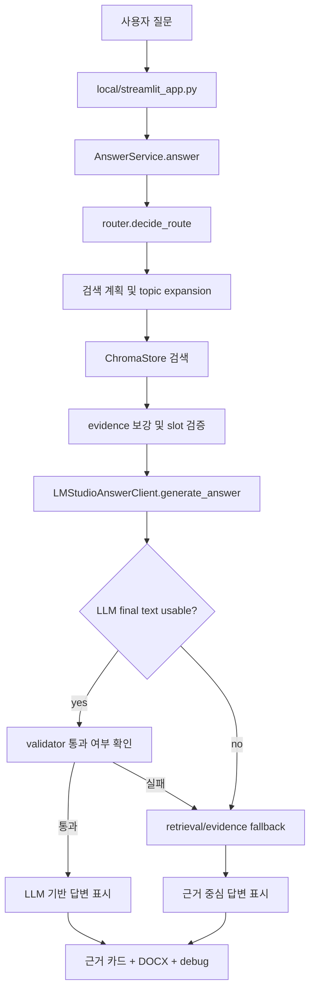

# Current Program and Repeated Error Report

작성일: 2026-04-21  
대상 저장소: `C:\AI\QKD\MVP_Military_basic_rule_finder`  
주요 대상 앱: `local/streamlit_app.py` 기반 LM Studio 로컬 군 복무 법규 RAG

## 1. 보고서 목적

이 문서는 지금까지 구축한 프로그램의 전체 구조와 현재 반복되는 오류를 다른 AI, 개발자, 또는 미래의 작업자가 그대로 이어받을 수 있도록 정리한 상세 인계 보고서다.

현재 사용자가 반복적으로 경험한 핵심 증상은 다음과 같다.

- 특정 질문, 예를 들어 “현행 「군인의 지위 및 복무에 관한 기본법」상 신고자 보호 규정을 조문번호와 함께 제시하고, 제44조의 비밀보장과 어떤 관계인지 3문장으로 설명해줘.” 같은 질문에서 LLM 답변이 아니라 “근거 중심으로 정리해 제공합니다.” 형태의 fallback 답변이 계속 나온다.
- LM Studio의 `gpt-oss-20b` 모델이 연결되어 있고 GPU도 동작하지만, 로컬 앱은 종종 LLM 최종 답변을 사용하지 못한다.
- 디버그 로그에는 `reasoning_only`, `low_information`, `garbled_text`, `validation_failed`, `context_size_exceeded` 같은 내부 실패 상태가 반복적으로 기록된다.
- 사용자는 “LLM 기반 답변”을 원하지만, 앱은 안전장치 때문에 LLM 답변이 조금이라도 불안정하면 deterministic retrieval 기반 답변으로 내려간다.

중요한 결론부터 말하면, 이 문제는 하나의 버그가 아니라 **로컬 모델 출력 안정성, LM Studio endpoint 동작, 프롬프트 길이, 답변 검증기, 검색 근거 누락, UI/fallback 정책이 동시에 얽힌 복합 문제**다.

## 2. 현재 프로그램의 목적

이 저장소는 일반 법률상담 챗봇이 아니라, 논문 “국방 AX전환을 위한 지식관리체계 설계 방안 - 법령, 규정 개정 이력을 중심으로 -”의 시연용 MVP다.

핵심 목적은 다음과 같다.

1. 군 법령 및 규정의 변경 이력을 조직기억으로 보존한다.
2. 사용자가 특정 시점, 현행 조문, 개정 이유, 연혁, 신구 비교를 함께 확인할 수 있게 한다.
3. LLM을 단독 법률 판단 주체로 쓰지 않고, 검색된 근거를 요약·연결·설명하는 보조 계층으로 사용한다.
4. 군 단독망 또는 사무실 단위 로컬 환경에서도 동작할 수 있는 구조를 검토한다.

따라서 앱의 철학은 “유창한 답변”보다 “근거 추적성, 시점 정합성, 공식/참고 자료 구분”에 더 가깝다. 이 철학 때문에 LLM 출력이 애매하면 앱이 의도적으로 답변을 보수적으로 제한한다.

## 3. 저장소의 두 UI 경로

현재 저장소에는 Streamlit UI가 두 개 있다.

### 3.1 공개 시연 경로

파일: `streamlit_app.py`

역할:

- 공개 배포 또는 일반 시연용 UI다.
- Gemini 또는 retrieval fallback 중심으로 동작한다.
- 질문 수 제한, 안전 문구, 근거 카드 표시 등 공개 서비스용 guardrail이 포함되어 있다.
- `LAW_API_KEY` 없이도 demo mode가 동작해야 한다.

### 3.2 로컬 LM Studio 실험 경로

파일: `local/streamlit_app.py`

역할:

- 현재 사용자가 주로 테스트 중인 경로다.
- LM Studio의 로컬 모델을 사용한다.
- `LMStudioAnswerClient`를 통해 `AnswerService`에 연결된다.
- 로컬 실행에서는 질문 횟수 제한과 생성 한도를 완화한다.
- 사용 시간, 토큰 수, 모델 정보, 디버그 패널, DOCX 내보내기를 표시한다.

현재 반복 오류는 대부분 이 로컬 경로에서 발생한다.

## 4. 핵심 코드 구성

### 4.1 설정

파일: `src/army_reg_rag/config.py`

주요 역할:

- 프로젝트 루트, Chroma 경로, runtime 경로, demo input 경로, processed data 경로를 설정한다.
- Streamlit 앱과 ingestion script가 같은 설정 객체를 공유한다.

### 4.2 도메인 모델

파일: `src/army_reg_rag/domain/models.py`

주요 모델:

- `DocumentChunk`: 법령 조각 단위 데이터. 법령명, 법령 레벨, 자료 유형, 공포일, 시행일, 조문번호, 조문 제목, 원문 링크 등을 담는다.
- `SearchHit`: 검색 결과와 점수를 묶는다.
- `RouteDecision`: 질문 intent, 선호 자료 유형, 라우팅 근거를 담는다.
- `AnswerBundle`: 최종 답변, 근거, backend, notice, diagnostics를 묶어 UI에 넘긴다.

### 4.3 데이터 수집 및 정규화

주요 파일:

- `src/army_reg_rag/corpus/public_law_pipeline.py`
- `scripts/build_sample_corpus.py`
- `scripts/ingest_to_chroma.py`

주요 역할:

- 국가법령정보센터 등 공개 자료를 raw/processed로 분리한다.
- raw 자료는 `data/raw/public_law/` 아래에 저장된다.
- processed JSONL은 `data/processed/law_corpus.jsonl` 또는 sample corpus로 저장된다.
- Chroma 입력용 chunk는 법령명, source_type, 시행일 등 메타데이터를 포함한다.

현재 주요 corpus 범위:

- 「군인의 지위 및 복무에 관한 기본법」
- 같은 법 시행령
- 같은 법 시행규칙
- 군인복무규율의 초기/말기/개정이유/연혁 자료
- 일부 군인사법, 군인 징계령, 군인 징계령 시행규칙 raw 자료 추가 흔적

주의:

- `군인사법`, `군인 징계령`, `군인 징계령 시행규칙`은 징계 종류·절차 질문에 중요하지만, 현재 corpus 반영 범위와 검색 품질은 별도 검증이 필요하다.

### 4.4 검색 계층

주요 파일:

- `src/army_reg_rag/retrieval/router.py`
- `src/army_reg_rag/retrieval/chroma_store.py`

주요 역할:

- 질문을 intent로 분류한다.
- intent에 따라 선호 source_type을 정한다.
- Chroma 또는 fallback store에서 유사 문서를 검색한다.

현재 intent 구조:

- `search` 또는 `current_rule`: 현행 조문 확인
- `explain_change`: 개정 이유 또는 변화 흐름 설명
- `practical`: 실무 참고 질문
- `hybrid` 또는 `mixed_complex`: 현행 조문, 개정 이유, 연혁을 함께 묻는 복합 질문

현재 문제가 자주 발생하는 질문 유형:

- 특정 조문을 명시하면서 조문 간 관계를 설명해 달라는 질문
- 예: 제43조, 제44조, 제45조 연결 구조
- 예: 군인복무규율 폐지 후 기본법 체계 재편과 현재 징계 법령 구분

이 유형은 검색, 요약, 검증이 모두 필요해 가장 취약하다.

### 4.5 답변 조립 계층

파일: `src/army_reg_rag/services/answer_service.py`

주요 역할:

- route 결정
- 관련 법령 및 topic 확장
- Chroma 검색
- 특정 질문 유형별 evidence 보강
- 명시 조문 누락 진단
- LLM client 호출
- fallback 답변 조립
- 최종 `AnswerBundle` 생성

현재 이 파일은 여러 번의 안정화 패치를 거치면서 특수 케이스 보강 로직이 많아졌다.

예상되는 위험:

- 특정 질문을 고치기 위해 추가한 `_ensure_*_support` 계열 보강 로직이 다른 질문에서 예상치 못한 검색 결과를 밀어낼 수 있다.
- 질문에 `제44조`가 있어도 retrieval 상위 결과에 제44조가 없으면 LLM이 “근거 없음”으로 판단하거나 validator가 답변을 버릴 수 있다.
- 복합 질문에서 “현행 조문”과 “개정 이유”가 같이 필요하지만, 검색 결과 slot이 한쪽으로 치우칠 수 있다.

### 4.6 LLM client

파일: `src/army_reg_rag/llm/lm_studio_client.py`

주요 역할:

- LM Studio 연결 확인
- loaded model 또는 visible model 확인
- 모델별 endpoint 선택
- request payload 구성
- response parsing
- reasoning-only, empty, low-information, garbled text 감지
- raw debug JSON 저장
- 실패 시 retrieval fallback으로 전환

현재 사용 endpoint:

- `/v1/responses`
- `/v1/chat/completions`
- `/api/v1/chat`

모델별 현재 추정 정책:

- `gpt-oss-20b`: 주로 `/v1/responses` 우선, 실패 시 native chat retry 시도
- `exaone-4.0-1.2b`: 짧은 요약 또는 제한된 생성에 적합
- `exaone-deep-7.8b`: reasoning token만 소모하고 final answer를 내지 못하는 문제가 있었음

핵심 문제:

- `gpt-oss-20b`가 `/v1/responses`에서 final output 없이 reasoning만 생성하는 경우가 반복된다.
- 같은 모델이 raw response로 `????????`만 반환한 사례가 있다.
- 이 경우 앱이 아무리 parser를 고쳐도 이미 LM Studio가 반환한 원문 자체가 손상되어 있으므로, 앱 내부에서 정상 한국어 답변으로 복구할 수 없다.

### 4.7 프롬프트 계층

파일: `src/army_reg_rag/llm/prompts.py`

주요 역할:

- 로컬 모델용 system prompt와 user prompt 구성
- source evidence를 짧게 압축
- intent별 답변 방향 제시
- 작은 모델과 중형 모델의 prompt profile 분리

현재 위험:

- gpt-oss 계열은 reasoning token을 많이 쓰므로, 짧은 답변을 요구해도 내부 reasoning만 하다가 final answer가 비거나 짧아질 수 있다.
- 질문, 근거, 규칙, 출력 형식이 모두 들어가면 prompt가 길어지고, LM Studio context size를 초과할 수 있다.
- “근거에 없는 내용은 쓰지 말 것”과 “질문에 제44조 관계를 설명하라”가 충돌하면 모델이 매우 보수적인 답변 또는 “자료 제한” 답변으로 빠질 수 있다.

### 4.8 Gemini/fallback 답변 생성기

파일: `src/army_reg_rag/llm/gemini_client.py`

이름은 `GeminiAnswerClient`지만, 현재는 Gemini API 호출뿐 아니라 deterministic fallback answer builder 역할도 많이 포함한다.

주요 역할:

- 근거 기반 fallback 답변 생성
- 조문 요약 문장 생성
- 개정 이유, 연혁, 실무 참고 섹션 구성
- incomplete sentence, noisy legal line, fragment 정리
- 특정 article title에 대한 보수적 요약 생성

현재 위험:

- 실제 Gemini client와 fallback builder가 같은 클래스에 섞여 있다.
- 파일이 매우 길고, “LLM client”와 “deterministic renderer” 책임이 분리되어 있지 않다.
- fallback 문장이 사용자 기대보다 템플릿처럼 보일 수 있다.

### 4.9 DOCX 내보내기

파일: `src/army_reg_rag/export_docx.py`

역할:

- Streamlit 대화 이력을 DOCX로 변환한다.
- 질문, 답변, 근거 카드 정보를 문서에 넣는다.

주의:

- 기본 DOCX에는 내부 debug 상태명을 숨기는 정책이 필요하다.
- 논문 시연 캡처용이라면 “사용자에게 보이는 답변”과 “디버그 정보”를 분리해야 한다.

## 5. 현재 답변 흐름

현재 로컬 앱의 전체 흐름은 아래와 같다.



사용자 관점에서는 LLM이 연결되어 있는데도 fallback이 나오는 것처럼 보인다. 그러나 내부 관점에서는 LLM이 다음 중 하나에 걸려서 버려지고 있다.

- final answer가 비어 있음
- reasoning만 있음
- 너무 짧고 정보량이 없음
- 물음표 반복 같은 garbled output
- validator가 unsupported 또는 unsafe하다고 판단
- context size 초과

## 6. 확인된 반복 오류 유형

최근 debug artifact 위치:

`data/runtime/lm_studio_debug/`

최근 확인된 파일 예시:

- `20260421_180926_725257_gpt-oss-20b_http_127.0.0.1_1234_api_v1_chat_validation_failed.json`
- `20260421_180308_519462_gpt-oss-20b_http_127.0.0.1_1234_api_v1_chat_reasoning_only.json`
- `20260421_180215_933390_gpt-oss-20b_http_127.0.0.1_1234_v1_responses_low_information.json`
- `20260421_152651_684956_gpt-oss-20b_http_127.0.0.1_1234_api_v1_chat_garbled_text.json`
- `20260421_143829_972029_gpt-oss-20b_http_127.0.0.1_1234_v1_chat_completions_reasoning_only.json`
- `20260421_085306_252153_gpt-oss-20b_http_127.0.0.1_1234_v1_responses_http_error.json`

### 6.1 `reasoning_only`

증상:

- HTTP status는 200이다.
- LM Studio는 응답을 준다.
- 그러나 final answer text가 비어 있다.
- token usage는 대부분 reasoning tokens로 소모된다.

예시:

- `/v1/responses`
- `output_tokens`: 508
- `reasoning_tokens`: 508
- `parsed_text_length`: 0

의미:

- 모델이 내부 추론은 했지만 사용자에게 보여줄 최종 답변을 만들지 못했다.
- parser 문제라기보다 response payload 자체에 final output text가 없거나 LM Studio가 reasoning만 노출한 경우다.

앱의 현재 처리:

- reasoning-only를 실패로 보고 retry 또는 fallback한다.
- 사용자는 “근거 중심으로 정리해 제공합니다.”를 보게 된다.

### 6.2 `low_information`

증상:

- final text는 존재한다.
- 그러나 내용이 “현재 자료 기준으로 확인되는 내용은 제한적입니다.” 정도로 너무 짧다.
- `parsed_text_length`가 27 근처로 기록된다.

의미:

- 모델이 근거 부족, prompt 충돌, 과도한 보수 규칙 때문에 답변을 회피한다.
- 실제로는 근거가 있는데, prompt에 전달된 evidence가 부족하거나 제44조 같은 핵심 근거가 누락되면 이런 답변이 나온다.

앱의 현재 처리:

- low-information으로 판단하고 fallback한다.

### 6.3 `garbled_text`

증상:

- LM Studio raw JSON의 `output_text` 또는 native chat `content`가 `????????????????` 형태로 나온다.
- 이 경우 화면 렌더링 문제가 아니라, LM Studio가 반환한 원문 자체가 이미 물음표다.

확인된 예:

- `20260421_152651_684956_gpt-oss-20b_http_127.0.0.1_1234_api_v1_chat_garbled_text.json`
- `/v1/responses`: parsed length 519, text prefix가 전부 `?`
- `/api/v1/chat`: parsed length 899, text prefix가 전부 `?`

의미:

- 앱의 Markdown, Streamlit 폰트, Python encoding 문제가 아니다.
- 모델 런타임, LM Studio endpoint, model template, quantization, tokenizer, 또는 gpt-oss 계열의 compatibility 문제일 가능성이 높다.
- 앱은 이 출력을 정상 한국어로 복구할 수 없다.

앱의 현재 처리:

- `garbled_text`로 감지하고 fallback한다.

### 6.4 `context_size_exceeded`

증상:

- `/v1/responses`가 HTTP 500을 반환한다.
- response payload에 `Context size has been exceeded.`가 기록된다.

예시:

- `20260421_085306_252153_gpt-oss-20b_http_127.0.0.1_1234_v1_responses_http_error.json`

의미:

- 질문, system prompt, evidence, 출력 형식 규칙이 합쳐져 LM Studio에서 설정된 context window를 초과했다.
- RAG prompt는 근거를 많이 넣을수록 좋아 보이지만, 로컬 모델에서는 context limit과 reasoning token 예산을 빠르게 소모한다.

앱의 현재 처리:

- http_error 또는 context size failure로 fallback한다.

### 6.5 `validation_failed`

증상:

- LLM이 실제 한국어 답변을 생성한다.
- 그러나 validator가 답변을 폐기하고 fallback한다.

예시:

`20260421_180926_725257_gpt-oss-20b_http_127.0.0.1_1234_api_v1_chat_validation_failed.json`

이 파일의 2차 attempt는 다음과 같은 답변을 생성했다.

> 가혹행위 신고를 접수하면, 신고자는 징계나 차별 등 불이익을 받지 않도록 보호되며 국방부 장관은 그 내용의 비밀을 보장하고 신고자에게 불이익 조치를 금지한다. 동시에 신고자는 상관이나 군 수사기관에 즉시 보고된다.

그러나 이 답변은 최종 사용자 답변으로 채택되지 않았다.

가능한 이유:

- “신고가 접수된 뒤”라는 질문을 모델이 “신고자는 즉시 보고된다”처럼 부정확하게 표현했다.
- 제43조는 신고의무를 말하지, “신고자가 보고된다”는 의미가 아니다.
- 제44조와 제45조 관계를 설명해야 하는데, 답변이 제44조 근거를 충분히 정확히 분리하지 못했을 수 있다.
- validator가 unsupported addition 또는 statute linkage issue로 판단했을 가능성이 있다.

의미:

- 이 경우는 LLM이 “아예 안 된 것”이 아니라, 앱의 보수적 검증기가 LLM 답변을 거부한 것이다.
- 법령 RAG에서는 이 처리가 안전하지만, 사용자는 “LLM이 작동하지 않는다”고 느낄 수 있다.

## 7. 왜 같은 오류가 계속 반복되는가

현재 반복의 핵심은 “서로 다른 실패 원인이 사용자 화면에서는 모두 근거 중심 fallback으로 보인다”는 점이다.

같은 질문을 했을 때도 내부에서는 다음 경로 중 하나가 발생할 수 있다.

1. `/v1/responses`가 reasoning-only를 반환한다.
2. `/api/v1/chat` retry가 reasoning-only 또는 garbled text를 반환한다.
3. LLM이 답변을 만들지만 validator가 거부한다.
4. 검색에서 명시 조문이 누락되어 LLM prompt가 근거 부족 상태가 된다.
5. prompt가 길어져 context size를 초과한다.
6. fallback renderer가 근거 카드를 바탕으로 답변을 만들지만 사용자는 이를 “LLM 미사용”으로 인식한다.

즉, “계속 근거 중심만 나온다”는 화면 증상은 동일하지만 실제 내부 실패 원인은 매번 다를 수 있다.

## 8. 현재 질문이 특히 어려운 이유

문제 질문:

> 현행 「군인의 지위 및 복무에 관한 기본법」상 신고자 보호 규정을 조문번호와 함께 제시하고, 제44조의 비밀보장과 어떤 관계인지 3문장으로 설명해줘.

이 질문은 겉보기에는 단순하지만, 앱 입장에서는 다음 조건을 모두 만족해야 한다.

1. 현행 「군인의 지위 및 복무에 관한 기본법」을 정확히 선택해야 한다.
2. `제45조(신고자 보호)`를 검색해야 한다.
3. 사용자가 직접 언급한 `제44조(신고자에 대한 비밀보장)`도 검색해야 한다.
4. 제43조 신고의무가 보조 근거로 들어갈 수 있지만, 답변 중심이 제44·45조에서 벗어나면 안 된다.
5. LLM은 “비밀보장”과 “불이익조치 금지”를 구분해야 한다.
6. “신고가 접수된 뒤 신고자가 보고된다” 같은 부정확한 말을 하면 안 된다.
7. 근거에 없는 절차, 기관, 효과를 추가하면 validator가 막아야 한다.

따라서 이 질문은 단순 조문 검색 질문이 아니라 “조문 관계 설명 + 근거 제한 + 안전 검증”이 결합된 질문이다.

## 9. 지금까지 적용된 주요 조치

### 9.1 LM Studio response parsing 강화

적용 위치:

- `src/army_reg_rag/llm/lm_studio_client.py`

추가·개선된 내용:

- `output_text`
- `choices[0].message.content`
- `choices[0].text`
- native `/api/v1/chat` output
- reasoning-only 감지
- garbled text 감지
- raw response JSON 저장

효과:

- “응답이 비어 있음”과 “실제로 모델이 reasoning만 함”을 구분할 수 있게 됐다.
- 디버그 artifact가 남아 원인 분석이 가능해졌다.

한계:

- raw JSON 자체가 `????`이면 parser는 고칠 수 없다.

### 9.2 endpoint fallback 추가

적용 위치:

- `src/army_reg_rag/llm/lm_studio_client.py`

내용:

- `gpt-oss-20b`는 `/v1/responses`를 우선 사용한다.
- 실패 시 `/v1/chat/completions` 또는 `/api/v1/chat` retry를 시도한 이력이 있다.

효과:

- 일부 상황에서 `/v1/responses` reasoning-only 이후 native chat에서 답변이 나왔다.

한계:

- 같은 모델이 모든 endpoint에서 `????`를 반환하면 retry가 오히려 지연만 늘린다.
- endpoint retry는 LM Studio/model runtime 문제를 해결하지 못한다.

### 9.3 LLM 실패 상태 debug 저장

적용 위치:

- `data/runtime/lm_studio_debug/`

내용:

- model name
- endpoint
- HTTP status
- finish_reason
- token usage
- raw response JSON
- parsed final text
- failure type
- attempts

효과:

- 사용자의 “왜 안 되지?”를 실제 payload 기준으로 판단할 수 있게 됐다.

한계:

- 현재 artifact schema는 일부 파일에서 top-level에 바로 실패 정보가 있지 않고 `summary` 안에 들어 있다.
- 후속 분석자는 `summary`와 `attempts`를 함께 봐야 한다.

### 9.4 사용자 화면의 내부 상태명 노출 완화

적용 위치:

- `local/streamlit_app.py`
- `streamlit_app.py`
- `scripts/evaluate_rag_integrity.py`

내용:

- `partial_salvaged`, `low_information`, `reasoning_only` 같은 내부 상태를 메인 화면에 직접 노출하지 않도록 조정했다.
- 사용자에게는 “근거 중심 정리”, “근거 기반 응답” 같은 표현을 보여주도록 했다.

효과:

- 논문 시연용 화면의 신뢰성을 높였다.

한계:

- 사용자는 여전히 “LLM이 답한 느낌”이 부족하다고 느낄 수 있다.

### 9.5 특정 조문 우선 검색 보강

적용 위치:

- `src/army_reg_rag/services/answer_service.py`
- `src/army_reg_rag/llm/gemini_client.py`

내용:

- 질문에 `제43조`, `제44조`, `제45조`처럼 명시 조문이 있으면 검색 결과와 fallback 답변에서 우선 반영하도록 보강했다.
- `제44조(신고자에 대한 비밀보장)`와 `제45조(신고자 보호)`를 fallback에서 분리 설명하도록 개선했다.

효과:

- deterministic fallback은 제44조와 제45조를 어느 정도 구분할 수 있게 됐다.

한계:

- LLM prompt에 들어가는 evidence selection과 fallback renderer의 evidence selection이 항상 완전히 같지는 않을 수 있다.
- LLM이 생성한 표현이 validator를 통과하지 못하면 여전히 fallback으로 내려간다.

### 9.6 평가 스크립트 추가

적용 위치:

- `scripts/evaluate_rag_integrity.py`
- `tests/fixtures/golden_questions.jsonl`

내용:

- RAGAS, TruLens RAG Triad, DeepEval의 개념을 가볍게 반영해 앱 내부 평가 기준을 만들었다.
- 주요 질문에 대해 intent, retrieved slot coverage, missing refs, backend, public notice, internal status를 기록한다.

효과:

- 단발성 수동 테스트가 아니라 golden question 기반 회귀 점검이 가능해졌다.

한계:

- 실제 RAGAS/DeepEval 라이브러리 기반 정량 평가는 아직 아니다.
- LLM live generation은 안정성이 낮아 기본 평가는 deterministic fallback 위주다.

## 10. 최근 검증 상태

최근 성공한 검증:

```powershell
python scripts/build_sample_corpus.py
python scripts/ingest_to_chroma.py --input data/sample/processed/sample_documents.jsonl
pytest -q
python scripts/evaluate_rag_integrity.py
```

최근 결과:

- sample corpus build 성공
- Chroma ingest 성공
- pytest: 83 passed
- integrity report 생성됨
  - `data/runtime/eval_reports/rag_integrity_20260421_155556.json`
  - `data/runtime/eval_reports/rag_integrity_20260421_155556.md`

주의:

- 이 테스트 통과는 “앱의 fallback 안정성”을 보장하는 것이지, “gpt-oss-20b가 항상 좋은 한국어 답변을 생성한다”는 뜻이 아니다.

## 11. 첨부 HTML 파일 관련

사용자가 언급한 파일:

`C:/Users/psm17/Downloads/gpt 20b 로컬 군 복무 법규 RAG.html`

현재 점검 시점에는 해당 경로에서 파일 존재를 확인하지 못했다.

가능한 이유:

- 파일명이 변경되었거나 이동되었을 수 있다.
- 다운로드 폴더에서 삭제되었을 수 있다.
- Codex 실행 환경에서 해당 파일 경로 접근이 제한되었을 수 있다.

따라서 이 보고서는 HTML 파일 내용이 아니라 저장소 코드와 `data/runtime/lm_studio_debug/`의 실제 JSON artifact를 기준으로 작성했다.

## 12. 한글 깨짐에 대한 구분

분석 중 PowerShell 출력에서 일부 한글이 깨져 보이는 현상이 있었다. 하지만 Python으로 UTF-8 디코딩하여 확인한 결과, 핵심 파일의 문자열은 대체로 유효한 UTF-8이었다.

구분해야 할 두 가지 현상:

### 12.1 터미널 출력 인코딩 문제

증상:

- PowerShell에서 `Get-Content` 출력 시 한글이 mojibake처럼 보인다.

의미:

- 터미널 code page 또는 출력 encoding 문제일 수 있다.
- 반드시 파일 자체가 깨졌다는 의미는 아니다.

### 12.2 LM Studio raw response garbled text

증상:

- `data/runtime/lm_studio_debug/*.json` 안의 `parsed_text` 자체가 `????????`로 저장된다.

의미:

- 이 경우는 파일 출력 문제가 아니라 LM Studio가 실제로 물음표 문자열을 반환한 것이다.
- 앱이 정상 한국어로 복구할 수 없다.

현재 문제의 핵심은 12.2다.

## 13. 가장 가능성 높은 근본 원인

현재까지의 증거 기준으로 우선순위를 매기면 다음과 같다.

### 13.1 1순위: `gpt-oss-20b`와 LM Studio endpoint/runtime 호환 문제

근거:

- `/v1/responses`에서 reasoning token만 소모하고 final text가 비는 사례가 반복된다.
- `/v1/responses`와 `/api/v1/chat` 모두에서 `????`만 반환한 사례가 있다.
- HTTP 200이어도 usable answer가 아니다.

판단:

- 앱 parser만으로 해결할 수 없는 영역이다.
- LM Studio 버전, model template, quantization, tokenizer, context setting, chat template compatibility를 점검해야 한다.

### 13.2 2순위: prompt와 context budget 불균형

근거:

- `Context size has been exceeded.` 500 error가 발생했다.
- RAG prompt에 질문, 근거 4개, 규칙, 출력 형식, system prompt가 모두 들어간다.
- gpt-oss 모델은 reasoning token도 많이 사용한다.

판단:

- evidence 수와 excerpt 길이를 더 줄여야 한다.
- 특히 로컬 모델에는 “전체 답변”보다 “핵심 결론 + 짧은 해석”만 맡기는 것이 안정적이다.

### 13.3 3순위: validator가 LLM 답변을 폐기하는 구조

근거:

- native chat에서 한국어 답변이 생성되었지만 `validation_failed`로 폐기된 사례가 있다.
- 법령 질문에서는 이 보수성이 필요하지만, 사용자는 LLM이 안 쓰인다고 느낀다.

판단:

- validator는 유지하되, 왜 버렸는지 debug panel에 명확히 보여야 한다.
- 답변이 거의 맞지만 표현이 부정확한 경우, 완전 폐기보다 “문장 교정 fallback” 옵션도 검토할 수 있다.

### 13.4 4순위: 검색 evidence selection과 사용자 질문의 기대 불일치

근거:

- 사용자는 제44조와 제45조 관계를 묻지만, 검색 상위 결과가 제43조, 제45조, 개정이유 등으로 치우칠 수 있다.
- 명시 조문 누락 시 LLM이 “자료 제한”으로 답하거나 validator가 폐기한다.

판단:

- 명시 조문 질문은 semantic retrieval보다 exact metadata retrieval을 우선해야 한다.
- `제44조`처럼 질문에 직접 나온 조문은 similarity score와 무관하게 evidence에 포함되어야 한다.

## 14. 왜 “LLM 기반 답변”과 “안전한 RAG”가 충돌하는가

사용자는 LLM이 더 풍부하게 답하길 원한다. 그러나 법령 RAG 앱은 다음 이유로 LLM 답변을 쉽게 채택하지 않는다.

1. LLM은 근거에 없는 말을 자연스럽게 추가할 수 있다.
2. 조문 관계를 설명할 때 조문 번호나 주체를 바꿔 말하면 위험하다.
3. 군 법령·징계·신고자 보호는 실무 판단에 영향을 줄 수 있다.
4. 논문 방향은 “챗봇의 유창함”보다 “조직기억 보존과 근거 추적성”이다.

따라서 현재 앱은 LLM을 “최종 답변 단독 생성자”로 두지 않고, retrieval/fallback이 최종 안전망을 갖는 구조로 바뀌어 왔다.

문제는 이 안전망이 너무 자주 작동하면서 사용자가 “LLM이 불필요한 것 아닌가?”라고 느끼게 된 점이다.

## 15. 현재 구조의 장점

현재 앱은 실패가 많아 보이지만, 몇 가지 중요한 장점도 있다.

- LLM이 완전히 실패해도 답변 화면이 무너지지 않는다.
- 근거 카드는 계속 표시된다.
- raw response debug가 저장된다.
- 내부 실패 상태와 사용자-facing 상태를 분리하려는 구조가 있다.
- local PC에서 Chroma 검색과 Streamlit 앱은 동작한다.
- 논문에서 말하는 “로컬 환경에서도 근거 기반 RAG가 돌아간다”는 시연은 가능하다.

## 16. 현재 구조의 단점

현재 가장 큰 단점은 다음과 같다.

1. LLM 출력이 안정적이지 않다.
2. fallback이 자주 발생해 LLM 기반 답변처럼 느껴지지 않는다.
3. Gemini client, fallback builder, validator 역할이 섞여 있다.
4. LM Studio client에 endpoint retry, parsing, validation, fallback이 많이 들어가 복잡하다.
5. root UI와 local UI가 완전히 동일한 표시 정책을 공유하지 않는다.
6. 사용자-facing 상태와 debug 상태가 아직 완전히 깔끔히 분리되지 않은 이력이 있다.
7. 특정 질문 보강 로직이 누적되어 구조가 점점 특수 케이스 중심으로 흐르고 있다.

## 17. 다음 작업자가 반드시 봐야 할 파일

### 17.1 로컬 UI

`local/streamlit_app.py`

확인할 것:

- `AnswerService` 생성 시 어떤 client를 주입하는지
- `answer_backend`, `answer_notice`, `diagnostics`를 어떻게 표시하는지
- debug panel이 사용자 화면과 분리되어 있는지
- DOCX export에 내부 상태가 포함되는지

### 17.2 답변 orchestration

`src/army_reg_rag/services/answer_service.py`

확인할 것:

- `decide_route` 결과가 어떻게 검색 계획으로 바뀌는지
- 명시 조문 추출이 제대로 되는지
- `_ensure_*_support` 계열 보강 로직이 과도하지 않은지
- evidence slot 검증 결과가 diagnostics에 남는지

### 17.3 LM Studio client

`src/army_reg_rag/llm/lm_studio_client.py`

확인할 것:

- `gpt-oss-20b`가 어떤 endpoint를 타는지
- reasoning-only, garbled, low-information을 어떻게 감지하는지
- retry 정책이 같은 실패를 반복하지 않는지
- raw artifact 저장 schema가 일관적인지

### 17.4 Prompt builder

`src/army_reg_rag/llm/prompts.py`

확인할 것:

- local plain prompt가 너무 긴지
- evidence excerpt 길이가 context size를 초과하지 않는지
- “근거 없음” 지시가 너무 강해 low-information으로 빠지는지

### 17.5 Fallback renderer

`src/army_reg_rag/llm/gemini_client.py`

확인할 것:

- fallback 답변이 사용자의 질문에 직접 답하는지
- 제44조/제45조 같은 article title 기반 문장 생성이 정확한지
- “실무 참고”가 너무 일반론으로 반복되지 않는지

### 17.6 Debug artifacts

`data/runtime/lm_studio_debug/`

확인할 것:

- 최신 파일의 `summary.failure_type`
- 각 `attempts[*].endpoint`
- `attempts[*].parsed_text`
- `attempts[*].token_usage`
- raw `response_payload`

### 17.7 평가 harness

`scripts/evaluate_rag_integrity.py`

확인할 것:

- golden question별 backend와 public notice
- internal status가 사용자 화면에 노출되지 않는지
- missing refs가 제대로 기록되는지

## 18. 다음 디버깅 순서 제안

다음 작업은 아래 순서로 진행하는 것이 좋다.

### 18.1 LM Studio 자체 최소 테스트

앱을 통하지 말고 `scripts/test_lmstudio_connection.py` 또는 직접 HTTP request로 다음을 테스트한다.

1. 영어 한 문장 생성
2. 한국어 한 문장 생성
3. 한국어 법령 문장 요약
4. RAG evidence 1개만 넣은 짧은 질문

판단 기준:

- 이 단계에서도 `????`가 나오면 앱 문제가 아니다.
- LM Studio model/template/runtime 문제다.

### 18.2 gpt-oss 대신 EXAONE 테스트

목적:

- gpt-oss 계열이 Harmony/reasoning endpoint와 충돌하는지 확인한다.
- EXAONE 1.2B가 짧은 한국어 summary를 안정적으로 내는지 확인한다.

권장:

- EXAONE 1.2B에는 전체 답변을 맡기지 말고 핵심 결론 1~2문장만 맡긴다.
- 나머지 본문은 deterministic answer builder가 작성한다.

### 18.3 명시 조문 exact retrieval 우선화

질문에 `제44조`, `제45조`가 있으면 다음 순서로 evidence를 구성한다.

1. metadata exact match: law_name + article_no
2. article title exact/contains match
3. vector similarity
4. revision reason 보강

이렇게 해야 “제44조를 물었는데 제44조 근거가 prompt에 없음” 문제가 줄어든다.

### 18.4 LLM 채택 기준 조정

현재 validator가 너무 보수적으로 폐기하는 답변이 있다.

대안:

- 명백한 오류: 폐기
- 근거는 맞지만 표현이 부정확: deterministic rewrite로 교정
- 충분히 안전: LLM text 채택

즉, LLM 답변을 버리는 대신 안전한 문장으로 후처리하는 중간 단계가 필요할 수 있다.

### 18.5 artifact schema 통일

현재 debug JSON은 `summary`와 `attempts` 구조를 가진다. 과거 로그와 코드 일부는 top-level failure field를 기대하는 듯한 흔적이 있다.

권장 schema:

```json
{
  "timestamp": "...",
  "question": "...",
  "intent": "...",
  "summary": {
    "model_name": "...",
    "endpoint": "...",
    "http_status": 200,
    "finish_reason": "...",
    "parsed_text_length": 0,
    "failure_type": "reasoning_only",
    "internal_status": "reasoning_only",
    "fallback_reason": "reasoning_only",
    "token_usage": {}
  },
  "validator": {},
  "attempts": []
}
```

UI와 evaluator는 반드시 `summary`를 먼저 읽도록 통일해야 한다.

## 19. 당장 시연에서 사용할 운영 전략

논문 시연 목적이라면 다음 전략이 가장 현실적이다.

1. 메인 답변은 deterministic retrieval 기반으로 안정적으로 만든다.
2. LLM은 “핵심 결론” 또는 “실무 해석” 일부에만 사용한다.
3. LLM이 실패하면 사용자에게는 “근거 중심 정리”라고만 보여준다.
4. debug panel에는 LLM 실패 상태를 남긴다.
5. 논문에는 “로컬 모델이 항상 완벽히 답했다”가 아니라 “로컬 환경에서 근거 검색과 제한적 생성이 가능하며, 실패 시 근거 중심 fallback으로 안정성을 유지했다”고 쓰는 것이 정확하다.

이 표현이 논문 방향에도 더 안전하다.

## 20. 향후 개선안 3가지

### 개선안 1: 모델 계층 안정화

내용:

- gpt-oss 계열은 LM Studio에서 계속 reasoning-only 또는 garbled output이 나오면 시연 기본 모델에서 제외한다.
- EXAONE 또는 한국어 instruction-following이 안정적인 모델을 기본 로컬 모델로 지정한다.
- gpt-oss는 “실험 가능 모델”로만 둔다.

장점:

- 사용자 체감 품질이 즉시 좋아진다.
- 반복적인 `????`와 reasoning-only를 줄일 수 있다.

단점:

- gpt-oss-20b를 논문 시연 대표 모델로 쓰기는 어려워질 수 있다.

### 개선안 2: LLM 역할 재정의

내용:

- LLM이 전체 답변을 쓰는 구조를 포기하지는 않되, 본문 전체를 맡기지 않는다.
- LLM은 “핵심 결론 + 조문 관계 설명”만 담당한다.
- “주요 근거, 근거 안내, 원문 링크”는 deterministic builder가 담당한다.

장점:

- LLM 느낌은 유지된다.
- 근거 추적성도 유지된다.

단점:

- 사용자가 기대하는 완전 자유형 답변과는 다를 수 있다.

### 개선안 3: 검색-검증 중심 리팩터링

내용:

- `AnswerService`에서 특수 케이스를 줄이고, intent별 retrieval plan을 명시 객체로 만든다.
- explicit article refs, law family, source slot coverage를 먼저 확정한다.
- 그 다음 LLM prompt를 만든다.

장점:

- 반복 패치로 생긴 특수 케이스 충돌을 줄일 수 있다.
- 복잡 질문에서도 evidence 누락을 줄인다.

단점:

- 단기 땜질보다 시간이 더 걸린다.

## 21. 최종 판단

현재 프로그램은 실패한 프로젝트가 아니다. 오히려 법령 RAG MVP로서 중요한 사실을 보여주고 있다.

확인된 사실:

- 로컬 PC에서 Chroma 기반 검색과 Streamlit UI는 동작한다.
- 공개 법령 corpus를 근거 카드로 보여주는 구조는 동작한다.
- LLM 실패를 감지하고 fallback하는 안전망도 동작한다.
- 그러나 `gpt-oss-20b` + LM Studio 조합은 현재 한국어 법령 RAG 생성기로 안정적이지 않다.

현재 오류의 핵심:

- 앱이 LLM을 못 부르는 것이 아니라, LLM 출력이 비어 있거나, 깨지거나, 검증을 통과하지 못해 앱이 의도적으로 버리는 경우가 많다.
- 따라서 “왜 근거 중심으로만 나오냐”의 답은 “LLM이 연결되지 않아서”가 아니라 “연결은 되었지만 최종 답변으로 채택할 수 없는 출력이 반복되어 fallback이 작동하기 때문”이다.

논문과 MVP 방향에서 가장 안전한 결론:

- 이 앱은 “LLM이 단독으로 법령 답변을 잘한다”를 보여주는 도구가 아니다.
- 이 앱은 “버전 관리형 법령 아카이브 + 근거 검색 + 제한적 로컬 LLM 생성 + 실패 시 근거 중심 fallback” 구조가 군 단독망 환경에서 현실적인 대안이 될 수 있음을 보여주는 MVP다.

## 22. 다음 작업 체크리스트

다음 작업자는 아래 순서로 확인하면 된다.

1. `scripts/test_lmstudio_connection.py`로 LM Studio raw Korean output을 먼저 확인한다.
2. raw output이 `????`이면 앱 코드를 고치지 말고 LM Studio/model/template부터 점검한다.
3. raw output이 정상인데 앱에서 fallback이면 `data/runtime/lm_studio_debug/`의 `summary.failure_type`을 본다.
4. `validation_failed`면 validator가 어떤 unsupported 표현을 잡았는지 확인한다.
5. `low_information`이면 prompt evidence에 질문 핵심 조문이 들어갔는지 확인한다.
6. `context_size_exceeded`면 evidence count와 excerpt length를 줄인다.
7. `reasoning_only`면 gpt-oss endpoint 정책을 재검토하거나 다른 모델을 사용한다.
8. 명시 조문 질문은 vector search보다 exact metadata search를 먼저 적용한다.
9. 사용자가 보는 화면에는 내부 상태명을 숨기고, debug panel에만 남긴다.
10. 논문 시연에서는 “로컬 LLM 완전 자동 답변”보다 “근거 기반 안정 응답”을 강조한다.

